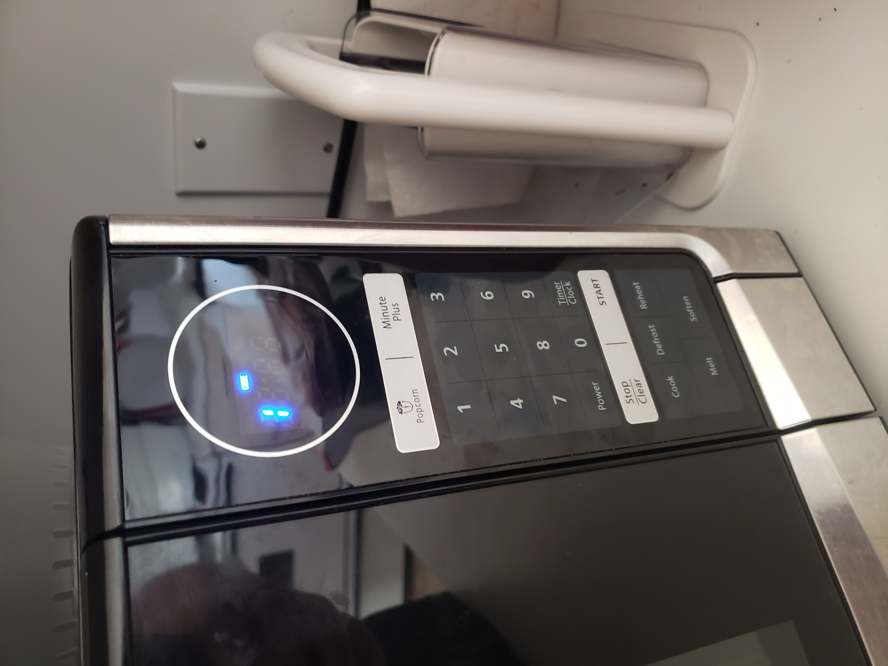
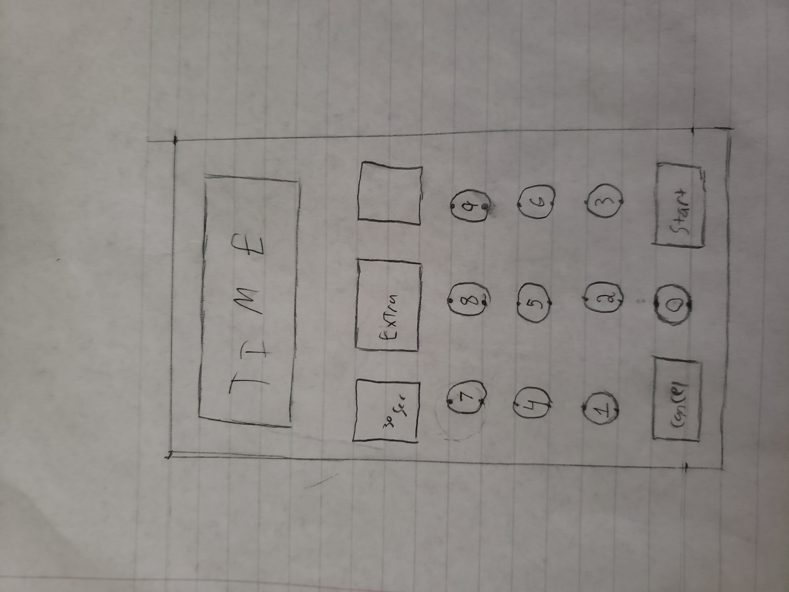

# p1.BryceBond

Project 1 URL: https://brybon.github.io/p1.BryceBond/

This is the microwave that i use

Most of the fucntions of this microwave are easy to under stand. It displays the time of day, has a quick action button of either cooking for a minute or popping popcorn, a numpad, the ability to start and stop, the ability to change the time, to start a timer, and the options to cook, defrost, reheat, melt and soften.

Here is a basic use of the microwave.

The bottem option buttons are where using the microwave gets confusing. The mircowave gives no feedback as to what each of the buttons actually does, outside of the word on the button. It can be assumed that power level of the mircowave changes based on the option, but the user does not get anything to confirm.

