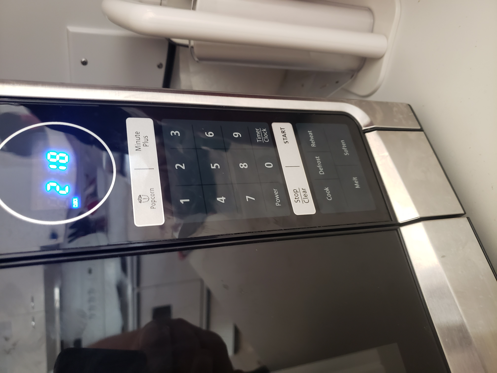
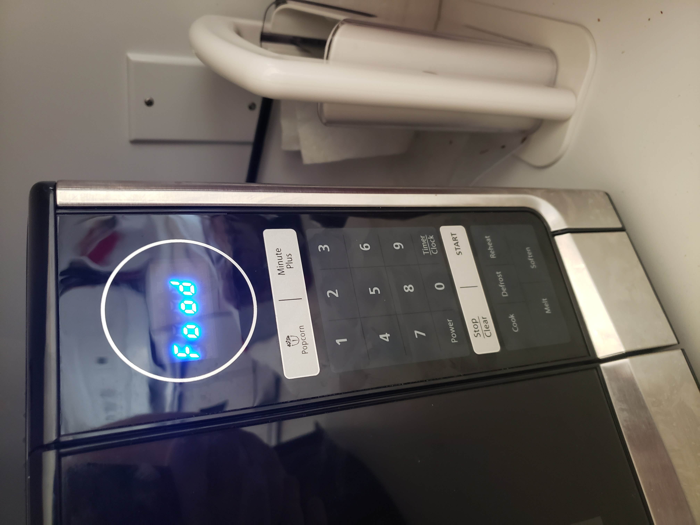

# p1.BryceBond

Project 1 URL: https://brybon.github.io/p1.BryceBond/

This is the microwave that I use

Most of the functions of this microwave are easy to understand. It displays the time of day, has a quick action button of either cooking for a minute or popping popcorn, a numpad, the ability to start and stop, the ability to change the time, to start a timer, and the options to cook, defrost, reheat, melt, and soften.

Here is a basic use of the microwave.

The bottom option buttons are where using the microwave gets confusing. The microwave gives no feedback as to what each of the buttons do, outside of the word on the button. It can be assumed that power level of the microwave changes based on the option, but the user does not get anything to confirm. 

When pressing the button for cook, defrost and reheat, the interface prompts FOOD but does not change unless Stop/Clear or START is pressed. After pressing START for defrost, cook, and reheat or by pressing melt or soften, the interface prompts for a code. 

The user is not told what this code is or does. This code number changes from 1 to 4 by pressing the 1 button. After pressing START the interface then prompts for AMT. 

The user is not told what AMT is. This number can change by pressing a number on the number pad up to 4. Pressing start then starts the microwave for a time based on the previous entries. This is counter intuitive and does not help the user use the microwave. 

In general, I use to reheat food. To do this, I don’t use the reheat option, I just press in what time I want and start. Outside of this, I’ve used the soften function to soften butter for baking. In general, the interface of the microwave works well for what I do, and doesn’t cause me any problems using it. This interface does make simple usage easy.

The most common sequence of actions the user will do is press the buttons on the numpad to equal a time that they want to use the microwave, and they will press start. The microwave will run until the timer ends, which will make it beep. If the user uses the 1 minute button, it starts a 1 minute cook time and will end. Pressing this button again while the microwave is in operation does nothing. Besides the ending beep, the microwave also beeps per button press. This is the only amount of feedback this interface gives. This interface tells the user what a button does in theory, but does not really give the user any other support to help a user to use it. If a user wants to do something more complicated than simply reheating, a user can make several errors. This stems from the lack of any proper feedback from the interface. A user can make the microwave cook for much longer than they want it to, or too short. The user can also make the microwave cook at a much lower or higher power than they want it to. This can compound on each other and cause the user to ruin whatever they were cooking.

My design keeps the time window , the num pad, start and stop, and changes the 1 minute button to a 30 second button. This 30 sec button will allow the user to add 30 seconds to the total cook time. This button can be pressed either before the cook time starts or during. I decided to remove the extra functions, such as defrost and melt, since these were time and power settings. I instead gave a button to control power, which would allow more control over the usage of the microwave.

